# 基於微調 Segment Anything Model (SAM) 的醫療零件瑕疵檢測

## 📖 專案簡介
本專案針對 **元利盛醫療零件瑕疵檢測**，解決 **表面亮度不均與低對比度** 的問題。我們主要探討 **Segment Anything Model (SAM) 結合 YOLO 預測的bounding box 作為 prompt** 在瑕疵檢測中的表現，並與 **YOLOv11-segmentation** 進行比較，分析兩者的優劣。

## 🎯 研究目標
- **使用 SAM 進行醫療零件的瑕疵分割**。
- **比較 SAM 與 YOLO 在瑕疵檢測的準確度與效率**。
- **開發高效、可靠的 AI 瑕疵檢測系統**。

## 🛠️ 方法
### **1️⃣ 數據準備**
- **標註方式**：
  - 使用 **Labelme** 進行多邊形標註。
  - 將 **Bounding Box 作為 Prompt** 餵入 SAM 進行分割。
- **數據增強**：
  - **翻轉、旋轉、馬賽克增強、色彩調整、透視變換**。
  - 資料集劃分：**80% 訓練集，20% 驗證集**。

### **2️⃣ YOLO-bounding-box 訓練**
- 將 **Ground Truth Mask** 轉換為 **Bounding Box json格式的標註**。    
- 再轉換為 **YOLO 訓練格式** (.txt)。  
- 訓練 **YOLOv11**，並優化超參數以提升偵測準確度。  

### **3️⃣ SAM 訓練**
- 產生 **Ground Truth Mask** 作為標準答案。
- 使用 **Bounding Box 作為 Prompt** 來微調 SAM。
- 在 **醫療零件瑕疵數據集** 上進行 **Fine-tuning**。

### **4️⃣ YOLO 與 SAM 比較**
| 模型 | mAP50 | mAP50-95 | Precision  | Recall |
|------|------|---------|-----------|--------|
| YOLOv11 | 0.97 | 0.52 | 90% (Mask Precision) | 0.9 |
| SAM | 0.9225 | 0.73 | 82.63% (Pixel-wise Precision) | 0.91 |

⚠️ **YOLO 的 Precision 與 SAM 的 Precision 無法直接比較**  
- **YOLO 的 Precision 是基於 Mask 級別（Mask Precision）**，表示**模型偵測出瑕疵的準確率**。  
- **SAM 的 Precision 是基於像素級分割（Pixel-wise Precision）**，表示 **分割出的瑕疵區域與 Ground Truth 的重合度**。  


### **5️⃣ YOLO 與 SAM 的優劣比較**
| 特色 | YOLO | SAM |
|------|------|------|
| **推理速度** | **快 (~0.02 秒/張圖)** | **慢 (~0.68 秒/張圖)** |
| **適用場景** | **目標偵測，邊界不精細的瑕疵** | **精細的瑕疵分割** |
| **訓練成本** | **較低** | **較高** |

### **為何選擇 SAM？**
- **對低對比度瑕疵效果較好**，可以細緻分割目標。
- **泛化能力強**，適合未標註過的瑕疵類別。
- **與 YOLO 互補**，可在 YOLO 預測的基礎上進一步提升精度。

## 🚀 挑戰與未來改進
### **主要挑戰**
- **低對比度瑕疵標註困難**，影響分割準確度。
- **SAM 訓練時間長**。
- **Bounding Box Prompt 的準確度影響 SAM 的結果**。

### **未來改進方向**
- **提升標註品質**，使用 **自動標註技術** 來改善 Ground Truth，以減少人工標註成本並提高數據一致性。  
- **對 SAM 進行數據增強**，提升模型的泛化能力，使其能適應更多樣化的瑕疵類型。  
- **使用 Low-Rank Adaptation（LoRA）優化 SAM 微調（fine-tuning）效率**，降低顯存消耗並減少訓練時間。  
- **應用 Edge Computing 進行即時部署**，優化模型以 **適用於嵌入式設備與邊緣端推理，提高即時性與計算效率**。  

## 🏭 產業應用
- **智慧製造**：應用於 **醫療、汽車、電子產業** 的自動瑕疵檢測。
- **醫療設備檢測**：利用 AI 進行 **醫療零件品質控管**。

## 📸 示意圖
### **1️⃣ SAM 訓練流程圖**
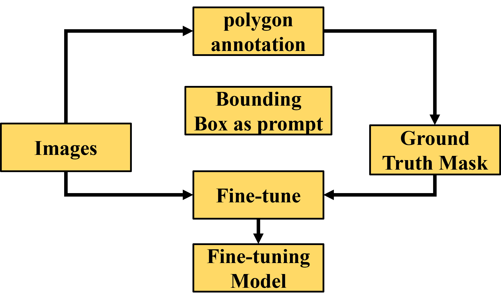
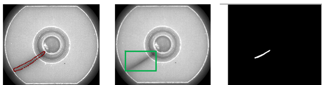

### **2️⃣ YOLO-bounding-box 訓練過程**
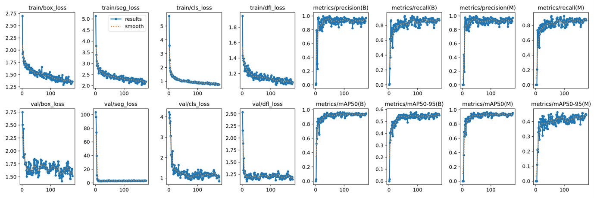

### **3️⃣ SAM 應用流程圖**
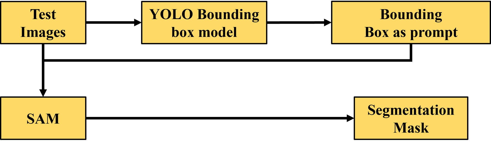

### **4️⃣ SAM Prediction v.s. Actual**
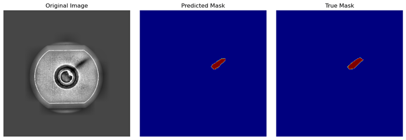
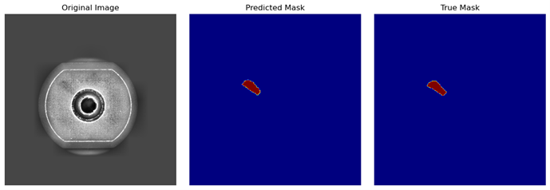
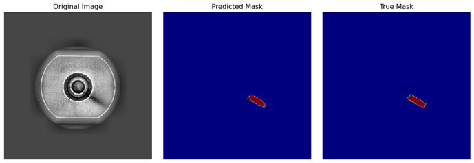
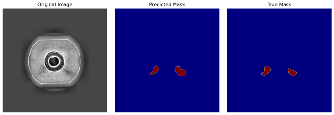

### **5️⃣混淆矩陣 & 評估指標 & Loss Curve**
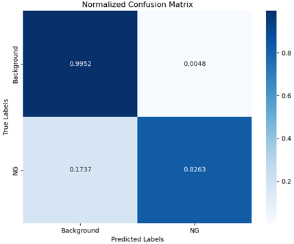
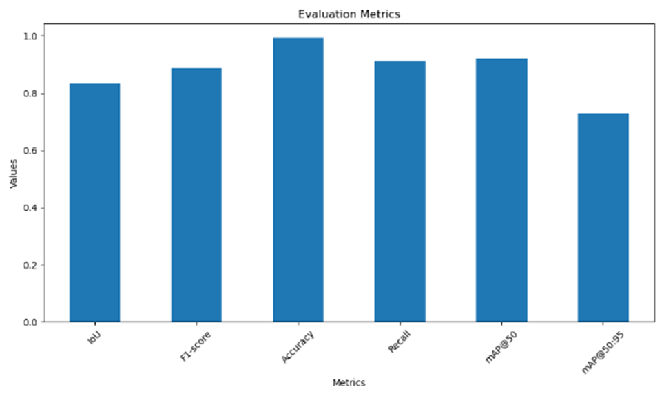
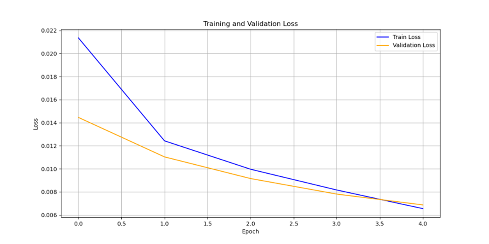

## 🛠️ 安裝與使用方式
### **1️⃣ Clone 專案**
```sh
git clone https://github.com/alfred99yeh/SAM-fintune-medical-devices.git
cd SAM-fintune-medical-devices
```
### **2️⃣ 安裝所需的 Python requirements**
```sh
pip install -r requirements.txt
```
### **3️⃣ 訓練 SAM**
```sh
python fine_tune_SAM_singlelabel_tqdm_plot.py
```
### **3️⃣ 測試 SAM**
```sh
python fine_tune_SAM_singlelabel_test.py
```
## 📜 授權條款
本專案採用 **MIT 授權條款**，您可以自由使用、修改和分發本專案，詳細內容請參閱 [LICENSE](LICENSE) 檔案。